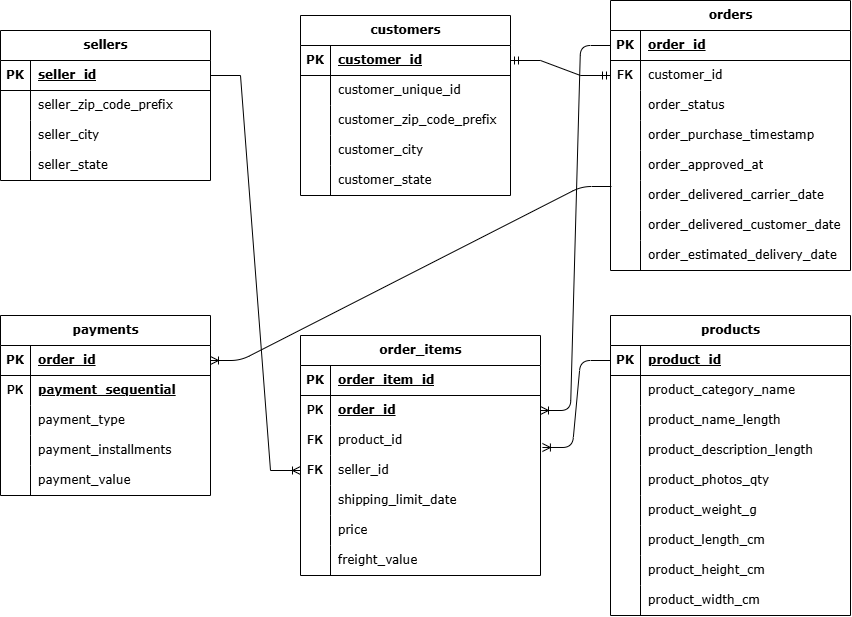
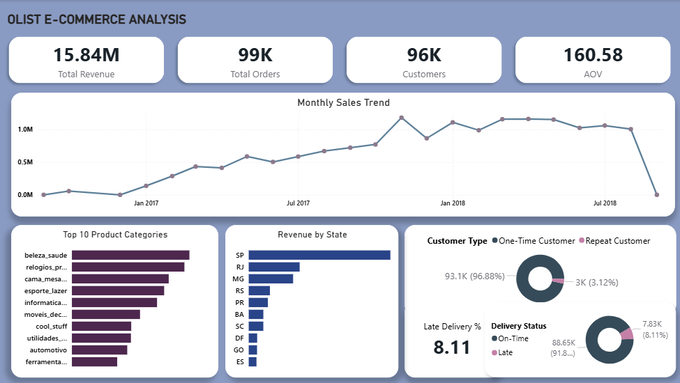

# E-Commerce Data Analysis (Olist Dataset)
-Nadhira Nurannisa-
## Project Overview

This project analyzes an e-commerce dataset to understand customer behavior, revenue trends, also product and delivery performance using SQL.

## Dataset

The dataset used in this project is the Brazilian E-Commerce Public Dataset by Olist, available on [Kaggle](https://www.kaggle.com/datasets/olistbr/brazilian-ecommerce).

Tables:
- Customers → customer information 
- Orders → order status and timestamps 
- Order Items → purchased products in each order 
- Products → product category information 
- Sellers → seller information 
- Payments → payment methods and transaction values 

*ERD*


## Business Questions

1. How many unique real customers are registered on the platform?
2. Which payment method is used most frequently by customers?
3. Which customers contribute the highest total spending?
4. Which products contribute the highest revenue?
5. Which sellers generate the highest revenue?
6. What is the monthly order trend over time?
7. What is the total revenue and how does revenue change over time?
8. What is the average order value?
9. How many delivery delays happened?
10. What percentage of customers make more than one order?  

## Key Insights

### 1. Total Real Customers
Olist has 96,069 unique real customers, indicating a large and diverse customer base.

### 2. Payment Method Distribution
Credit card is the most frequently used payment method, indicating strong customer preference for flexible payment options and installment-based purchases.

### 3. Top 10 Customers by Spending
A small number of customers contribute a large portion of total spending, indicating the importance of high-value customers to overall revenue. 

### 4. Top 10 Products by Revenue
A small number of products generate a significant portion of total revenue, indicating strong sales concentration among top-performing products. Beauty & Health (beleza_saude) is the highest revenue-generating product category, indicating strong customer demand for health and personal care products. 

### 5. Top 10 Sellers by Revenue
Revenue is concentrated among a small number of top-performing sellers. The top seller generated total revenue of 249,640.70, indicating a strong contribution to overall sales.

### 6. Monthly Trend Order
The data shows a monthly order trend from September 2016 to October 2018. Order volume peaked in November 2017 with 7,544 total orders, indicating a significant increase in customer purchasing activity during that period. 

### 7. Total Revenue and Monthly Revenue Trend
Total revenue reached 15,843,553.24 and monthly revenue peaked in November 2017 with total revenue of 1,179,143.77. 

### 8. Average Order Value
The average order value is 160.58, indicating the typical amount customers spend per transaction. 

### 9. Delivery Delay Analysis 
Approximately 8.1% of delivered orders arrived later than the estimated delivery date, indicating potential issues in delivery performance and customer experience.

### 10. Repeat Customer Rate 
The repeat customer rate is relatively low at 3.12%, indicating that most customers make only one purchase. This suggests an opportunity to improve customer retention and encourage repeat purchases. 

## Recommendations

- Improve customer retention through loyalty programs
- Optimize logistics to reduce delivery delays
- Increase promotion for high-performing product categories 
- Analyze customer segmentation for targeted campaigns

## Dashboard Preview
 
[View Dashboard](link-dashboard) 

## Tools

- Microsoft SQL Server
- SQL Server Management Studio (SSMS)
- Power BI 
- Python (for data cleaning / EDA)

## Project Structure
```text
/sql
├── exploration.sql
├── analysis.sql

/assets
├── erd.png
├── dashboard.png
``` 
## Conclusion

This project demonstrates how SQL can be used to analyze e-commerce performance, identify customer purchasing patterns, and generate actionable business insights. The findings can support data-driven decision-making in marketing, operations, and customer retention strategies.

